# claude-code-stack

Reproducible Windows 11 setup for a layered Claude Code environment: a local proxy
chain that every Claude Code request flows through, plus the MCP servers and the
OneDrive-backed memory sync that go with it.

One command on a fresh machine:

```powershell
git clone https://github.com/kshitijrm-ironman/claude-code-stack.git
cd claude-code-stack
powershell -ExecutionPolicy Bypass -File .\install.ps1
```

---

## What each piece does

| Component | Installed via | Role |
|---|---|---|
| **pxpipe** (`pxpipe-proxy`) | `npm install -g pxpipe-proxy` | Innermost proxy. Talks to the real Anthropic API. Listens on **47821**. |
| **Headroom** (`headroom-ai[all]`) | `pip install "headroom-ai[all]"` | Outer proxy on **8787**. Context compression + an MCP server. Forwards upstream to pxpipe. |
| **MemPalace** (`mempalace`) | `pip install mempalace` | Persistent long-term memory as an MCP server (`mempalace-mcp`). |
| **Playwright MCP** | `npx @playwright/mcp@latest` | Browser automation as an MCP server. Drives a downloaded Chromium. |
| **OneDrive memory sync** | directory symlink | `~/.claude/projects` lives on OneDrive so session history follows you across machines. |
| **Ponytail** (`DietrichGebert/ponytail`) | `/plugin marketplace add` + `/plugin install` | Claude Code plugin. Always-on anti-over-engineering ruleset + `/ponytail-*` commands. |
| **Graphify** (`graphifyy`) | `pip install graphifyy --allow-scripts` | Turns a folder of code/docs into a queryable knowledge graph. Used via the `/graphify` skill. |

### pxpipe
A small Node proxy that sits closest to the network. Everything upstream of it
(Headroom, Claude Code) treats it as if it were `api.anthropic.com`. It is started
at login by Task Scheduler through a VBScript shim so no console window ever flashes.

### Headroom
`headroom-ai[all]` provides two separate things that are easy to confuse:

- **`headroom proxy`** — the HTTP proxy on port 8787 that Claude Code points at.
- **`headroom mcp serve`** — an MCP server registered with Claude Code for on-demand
  context compression/retrieval.

Both are installed by the same package. The proxy is the piece that must be running
for Claude Code to work at all; the MCP server is additive.

### Ponytail
A Claude Code **plugin**, not a proxy or an MCP server. It installs a `SessionStart`
hook that injects an always-on "lazy senior developer" ruleset into every session,
plus six skills (`/ponytail`, `/ponytail-review`, `/ponytail-audit`,
`/ponytail-debt`, `/ponytail-gain`, `/ponytail-help`). Its hooks are Node scripts,
so `node` must be on the **non-interactive** shell's PATH — which this stack already
requires.

### Graphify
A Python package (`graphifyy`) plus a Claude Code **skill** at
`~/.claude/skills/graphify`. The skill drives the CLI to build a persistent
knowledge graph from any folder — code, docs, papers, images, video — and writes
`graphify-out/` with interactive HTML, GraphRAG-ready JSON, and `GRAPH_REPORT.md`.
Once `graphify-out/` exists, questions about the codebase get answered from the
graph (`/graphify query …`, `path`, `explain`) instead of a blind file sweep.

### The chain
`ANTHROPIC_BASE_URL` is set permanently to `http://127.0.0.1:8787`, so Claude Code
never contacts Anthropic directly. Requests hop Headroom → pxpipe → Anthropic, and
responses come back the same way.

---

## Architecture

```
                         ┌──────────────────────────┐
                         │       Claude Code        │
                         │  ANTHROPIC_BASE_URL =    │
                         │   http://127.0.0.1:8787  │
                         └───────────┬──────────────┘
                                     │ HTTPS-shaped HTTP
                                     ▼
        ┌────────────────────────────────────────────────────┐
        │  Headroom proxy          127.0.0.1:8787            │
        │  headroom proxy --port 8787                        │
        │      --anthropic-api-url http://127.0.0.1:47821    │
        │  · context compression                             │
        │  · Task Scheduler: at logon + 15s delay            │
        └───────────────────────────┬────────────────────────┘
                                    │ upstream
                                    ▼
        ┌────────────────────────────────────────────────────┐
        │  pxpipe                  127.0.0.1:47821           │
        │  node .../pxpipe-proxy/bin/cli.js                  │
        │  · Task Scheduler: at logon (no delay)             │
        └───────────────────────────┬────────────────────────┘
                                    │ TLS
                                    ▼
                        ┌───────────────────────┐
                        │   api.anthropic.com   │
                        └───────────────────────┘

   MCP servers (stdio, spawned by Claude Code — not part of the proxy chain)
   ├── headroom     headroom.EXE mcp serve
   ├── mempalace    mempalace-mcp
   └── playwright   npx @playwright/mcp@latest

   Memory sync
   C:\Users\<username>\.claude\projects  ──symlink──►  D:\OneDrive\Claude\projects
```

The 15-second delay matters: Headroom logs a failed upstream health check if pxpipe
is not already bound to 47821 when it starts. Ordering is enforced by the delay, not
by a dependency — Task Scheduler has no native "start after" relation.

---

## Setup flow

End to end, from a bare machine to a working stack. Everything above
`install.ps1` is manual and has to happen first — in particular Claude Code must
be installed **and logged in** before the installer runs, because step 4 shells
out to `claude mcp add`.

```mermaid
flowchart TD
    A(["Bare Windows 11 machine"]) --> B{"Node ≥ 18 and Python ≥ 3.10 on PATH?"}
    B -->|no| B1["Install Node.js ≥ 18<br/>Install Python ≥ 3.10"]
    B1 --> C
    B -->|yes| C["npm install -g @anthropic-ai/claude-code"]
    C --> D["Run claude, then /login<br/>account must be authenticated before step 4"]
    D --> E{"OneDrive synced, D:\OneDrive present?"}
    E -->|no| E1["Sync OneDrive, or plan to pass -OneDrivePath<br/>or skip with -SkipSteps 5"]
    E1 --> F
    E -->|yes| F["git clone the repo, then cd claude-code-stack"]
    F --> G["Open PowerShell as Administrator"]
    G --> H["powershell -ExecutionPolicy Bypass -File .\install.ps1"]

    H --> S1["Step 1 · 01-check-prereqs.ps1<br/>OS, elevation, Node, Python, Claude, OneDrive, ports"]
    S1 --> Q1{"All checks pass?"}
    Q1 -->|no| X1["Fix what it reports, rerun install.ps1"]
    X1 --> S1
    Q1 -->|yes| S2["Step 2 · 02-install-pxpipe.ps1<br/>npm i -g pxpipe-proxy · VBS shim · task pxpipe-proxy · port 47821"]
    S2 --> S3["Step 3 · 03-install-headroom.ps1<br/>pip install headroom-ai&#91;all&#93; · VBS shim · task Headroom Proxy at logon +15s · sets ANTHROPIC_BASE_URL"]
    S3 --> S4["Step 4 · 04-install-mcp-servers.ps1<br/>claude mcp add -s user — mempalace, playwright, headroom"]
    S4 --> S5["Step 5 · 05-link-onedrive-memory.ps1<br/>symlink ~/.claude/projects onto OneDrive"]
    S5 --> S6["Step 6 · 06-verify-stack.ps1<br/>ports, tasks, env var, MCP health, symlink"]

    S6 --> ACT{"Both proxies listening on 47821 and 8787?"}
    ACT -->|no| ACT1["Log out and back in,<br/>or start both tasks by hand 15s apart"]
    ACT1 --> V
    ACT -->|yes| V["Run .\scripts\06-verify-stack.ps1"]
    V --> Q2{"Every line reports &#91;ok&#93;?"}
    Q2 -->|no| T["See docs/troubleshooting.md"]
    T --> V
    Q2 -->|yes| Z(["Stack live — Claude Code → Headroom 8787 → pxpipe 47821 → api.anthropic.com"])
```



The same path as copy-pasteable commands:

```powershell
# --- manual prologue (once per machine) ---
winget install OpenJS.NodeJS.LTS
winget install Python.Python.3.12
npm install -g @anthropic-ai/claude-code
claude                      # then /login, and quit once authenticated

# --- the repo ---
git clone https://github.com/kshitijrm-ironman/claude-code-stack.git
cd claude-code-stack

# --- installer, from an elevated PowerShell ---
powershell -ExecutionPolicy Bypass -File .\install.ps1

# --- activate without logging out ---
Start-ScheduledTask -TaskName 'pxpipe-proxy'
Start-Sleep -Seconds 15
Start-ScheduledTask -TaskName 'Headroom Proxy'

# --- Claude Code layer (not covered by install.ps1) ---
pip install graphifyy --allow-scripts
graphify install --platform windows
claude                      # then: /plugin marketplace add DietrichGebert/ponytail
                            #       /plugin install ponytail@ponytail

# --- confirm ---
.\scripts\06-verify-stack.ps1
```

---

## Prerequisites

- **Windows 11** (the scripts hard-refuse anything else)
- **Node.js ≥ 18** with npm on PATH
- **Python ≥ 3.10** with pip on PATH
- **Claude Code** (`npm install -g @anthropic-ai/claude-code`)
- **Administrator** — required for `New-Item -ItemType SymbolicLink` and for
  registering scheduled tasks at `HighestAvailable`
- **OneDrive** synced, with `D:\OneDrive` present
- An Anthropic account already authenticated in Claude Code (`claude` → `/login`)

Developer Mode enabled in Windows Settings lets the symlink step work without
elevation, but the scheduled-task step still needs admin.

---

## Install

`install.ps1` runs the six steps in order and stops at the first failure:

| Step | Script | Does |
|---|---|---|
| 1 | `scripts/01-check-prereqs.ps1` | OS/Node/Python/Claude/admin/OneDrive checks |
| 2 | `scripts/02-install-pxpipe.ps1` | npm install, render VBS, register `pxpipe-proxy` task |
| 3 | `scripts/03-install-headroom.ps1` | pip install, render VBS, register `Headroom Proxy` task (15s), set `ANTHROPIC_BASE_URL` |
| 4 | `scripts/04-install-mcp-servers.ps1` | MemPalace + Playwright (+ Headroom) via `claude mcp add -s user` |
| 5 | `scripts/05-link-onedrive-memory.ps1` | symlink `~/.claude/projects` → OneDrive |
| 6 | `scripts/06-verify-stack.ps1` | ports, tasks, env var, MCP health, symlink |

Every script is idempotent — re-running on a configured machine reports
`already configured` and changes nothing. Useful flags:

```powershell
.\install.ps1 -WhatIf          # dry run, no changes
.\install.ps1 -SkipSteps 5     # skip the OneDrive symlink
.\install.ps1 -OneDrivePath 'E:\OneDrive\Claude\projects'
```

Individual steps are runnable on their own:

```powershell
powershell -ExecutionPolicy Bypass -File .\scripts\06-verify-stack.ps1
```

**Log out and back in** after installing — the scheduled tasks are logon-triggered,
and `ANTHROPIC_BASE_URL` only reaches new processes after a fresh session. To avoid
the logout, start both tasks by hand:

```powershell
Start-ScheduledTask -TaskName 'pxpipe-proxy'
Start-Sleep -Seconds 15
Start-ScheduledTask -TaskName 'Headroom Proxy'
```

---

## Plugins and skills

`install.ps1` does **not** install these — they are Claude Code layer, not proxy
layer, and both are added by hand once per machine.

### Ponytail

Inside a `claude` session:

```
/plugin marketplace add DietrichGebert/ponytail
/plugin install ponytail@ponytail
```

Restart Claude Code. A new session opens with `PONYTAIL MODE ACTIVE — level: full`.
Switch with `/ponytail lite|full|ultra`, or `/ponytail off`. The level persists for
the session.

### Graphify

From PowerShell:

```powershell
pip install graphifyy --allow-scripts
graphify install --platform windows
```

`--allow-scripts` is required — the package's post-install step is what puts the
`graphify` binary and the skill in place. `graphify install --platform windows`
writes the skill to `~\.claude\skills\graphify`.

Then, in any project:

```
/graphify                    # build the graph for the current directory
/graphify <path> --update    # re-extract only new/changed files
/graphify query "how does the proxy chain start?"
```

`graphify extract` is the underlying build step the skill calls; running the slash
command is the normal path. Output lands in `graphify-out/` in the scanned
directory — add it to that project's `.gitignore` unless you want the graph
committed.

---

## Verifying

```powershell
.\scripts\06-verify-stack.ps1
```

Expected:

```
[ok] pxpipe        listening on 47821 (node, pid 27324)
[ok] headroom      listening on 8787  (python, pid 27960)
[ok] task          pxpipe-proxy      Ready
[ok] task          Headroom Proxy    Ready  (logon +15s)
[ok] env           ANTHROPIC_BASE_URL = http://127.0.0.1:8787
[ok] mcp           mempalace, playwright, headroom connected
[ok] symlink       ~\.claude\projects -> D:\OneDrive\Claude\projects
```

---

## Docs

- [`docs/architecture.md`](docs/architecture.md) — request path, ports, why the chain is ordered this way
- [`docs/troubleshooting.md`](docs/troubleshooting.md) — symptoms → fixes
- [`docs/updating.md`](docs/updating.md) — upgrading each component safely

---

## Notes

- The npm package is **`pxpipe-proxy`**; the binary it puts on PATH is `pxpipe`.
  `npm install -g pxpipe` is a 404.
- Ports 47821 and 8787 are the defaults these scripts assume. Changing them means
  editing the Headroom `--anthropic-api-url`, the VBS templates, and
  `ANTHROPIC_BASE_URL` together.
- Nothing here stores an API key. Auth stays in Claude Code's own credential store.
