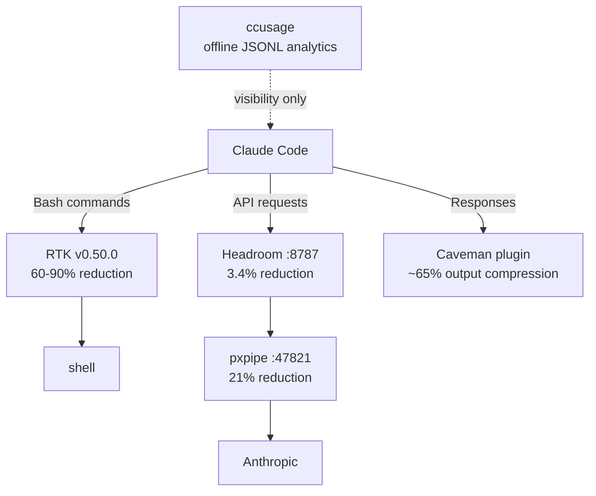

# Token optimization pipeline

Full path of a Claude Code request/response, with the token reduction applied at
each hop. Complements [`architecture.md`](architecture.md), which covers the
proxy chain's ports and ordering; this file adds the compression layer on top.

- **RTK** compresses noisy Bash tool output (build logs, test runs, `git diff`)
  before it's added to context.
- **Headroom → pxpipe** is the existing request/response proxy chain
  (see [`architecture.md`](architecture.md)); each hop trims payload size.
- **Caveman** compresses Claude's own reply text, not tool output.
- **ccusage** doesn't sit in the request path — it reads the local session
  JSONL files after the fact for usage/cost reporting (`npx ccusage@latest daily`).
